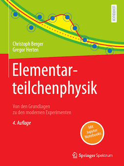

At the moment this book about Particle Physics is only available in german. 
The GitHub page for the german book is [BuchEPP.github.io](https://buchepp.github.io)
There you find Python Notebooks whith calculations done in the book. 

# Book: Particle Physics
As soon as the english version of the book is available, a link to the related GitHub page will be available here. 

Book
- Elementarteilchenphysik (in german)
- Publisher: Springer
- Authors: Christoph Berger, Gregor Herten 

Sub-folders contain:
- Solution hints for the exercise problems
- Notebooks with detailed calculations
- Corrections to the printed edition
 
### Authors
#### Christoph Berger
- Christoph Berger, born in 1939, studied in Darmstadt and Bonn and received his doctorate in Bonn in 1968. He carried out post-doctoral research at Cornell University. After his habilitation in Aachen in 1973, he was Professor of High Energy Physics at RWTH Aachen University from 1974 to 2004, with research visits to DESY and CERN. His main research activities are elastic and inelastic electron-proton scattering, electron-photon scattering and neutrino reactions at low energies.

#### Gregor Herten 
- Gregor Herten, born in 1955, studied at RWTH Aachen University and was awarded his doctorate there in 1983. He then carried out post-doctoral research at CERN. After a professorship at the Massachusetts Institute of Technology (1986-1992), he was Professor of Experimental Physics at the University of Freiburg from 1992 to 2023. His research activities deal with the measurement of reactions in 𝑒-𝑒+ annihilation and in proton-proton collisions as well as the development of precise detectors for muons.

### Information about the book 
This textbook on elementary particle physics, written in German, provides an introduction from the basics to modern experiments to the latest developments in particle physics. Experimental tools such as accelerators and detectors as well as the symmetry principles and their applications are also presented in detail. In addition, the Standard Model - which largely dominates today's experimental and theoretical discussion - is introduced. To this end, the book explains essential areas of quantum electrodynamics, the quark model, quantum chromodynamics and electroweak theory. The Lagrangian formalism formulates the standard model as a gauge theory and the Higgs mechanism is described in detail. Chapters on the physics of hadron colliders and neutrino physics tie in with current research and also examine possible extensions of the Standard Model in the light of recent experimental results. The appealing design of the textbook and the 187 exercises with solution instructions and supplements as Jupyter Notebooks on GitHub subsequently serve to deepen the knowledge.
The book is published by Springer with DOI: 10.1007/978-3-662-67387-4 (https://doi.org/10.1007/978-3-662-67387-4).

### Calculations with python
The very popular programming language Python is part of the curriculum at many universities. Sympy is a computer algebra programme based on Python. In conjunction with the Jupyter notebook, it provides an elegant framework for computer algebra. Please consult the Python and Jupyter pages to install these programs on your system. On this [GitHub link](https://github.com/BuchEPP/Buch) we provide additional material for detailed calculations and solution notes for the exercises. The Python programming is intentionally kept at a simple level so that beginners in programming can get started easily.  

### Contents

#### 1 Overview and Tools
- 1.1 Inward Bounds
- 1.2 The Elementary Particles
- 1.3 Cross sections and Decay Rates
- 1.4 Particle Accelerators
- 1.5 Detectors
- 1.6 Monte Carlo Simulatio

#### 2 The Scattering Matrix and its Symmetries
- 2.1 The Scattering Matrix
- 2.2 Rotations in Three Dimensions
- 2.3 Rotations and Translations in Four Dimensions
- 2.4 Applications 
- 2.5 Reflections and Parity Invariance
- 2.6 Time reversal
- 2.7 Internal Symmetries I 
- 2.8 Internal Symmetries II, Isospin and SU(2)

#### 3 Elementary Quantum Electrodynamics
- 3.1 Dirac Equation and Feynman Rules
- 3.2 Basic Reactions of QED
- 3.3 Higher Order Processes

#### 4 Quarks and Gluonsin Quantum Chromodynamics
- 4.1 Quarks with Color
- 4.2 Color Dynamics
- 4.3 The Structure of Hadrons
- 4.4 Electromagneticand Strong Decaysof Hadrons
- 4.5 New Heavy Quarks

#### 5 Electrons and Quarks
- 5.1 Electron-Positron Annihilation into Hadrons
- 5.2 ElasticElectron-Nucleon Scattering
- 5.3 Inelastic Electron-Nucleon Scattering
- 5.4 Two-Photon Physics

#### 6 From the Weak to the Electroweak Interaction
- 6.1 Weak Interactionof Leptons 
- 6.2 Weak Interactionof Quarks, Part I
- 6.3 Weak Interactionof Quarks,Part II
- 6.4 The Electroweak Interaction
- 6.5 Tests of the Electroweak Interaction

#### 7 The Standard Model asa Gauge Theory 
- 7.1 A Scalar Particle is Needed
- 7.2 Gauge Theories
- 7.3 Higgs Mechanism

#### 8 Hadron-Hadron Interactions
- 8.1 Calculation of Perturbative Cross Sections
- 8.2 Soft and Hard QCD Processes
- 8.3 Gauge Bosons and Top Quark
- 8.4 Higgs Boson

#### 9 Neutrino Masses and Neutrino Oscillations
- 9.1 Neutrino Oscillations 
- 9.2 Experiments on Neutrino Oscillations
- 9.3 Extension of the Standard Model with Neutrino Masses

#### 10 Beyond the Standard Model
- 10.1 Open Questions
- 10.2 Grand Unification
- 10.3 Supersymmetry
- 10.4 Outlook

#### Appendix
- A.1 Measurement Systems and Constants
- A.2 Application of Feynman Rules
- A.3 Python

  

